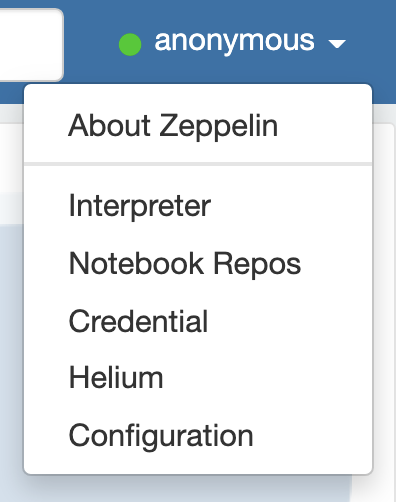
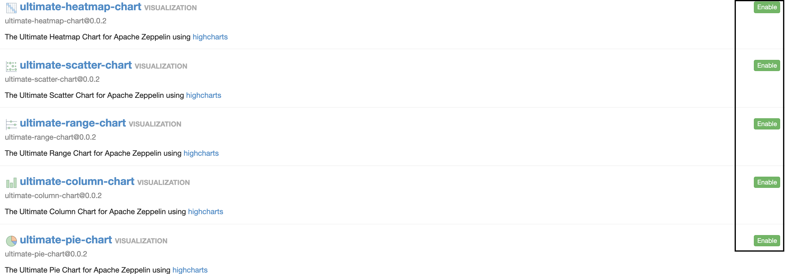
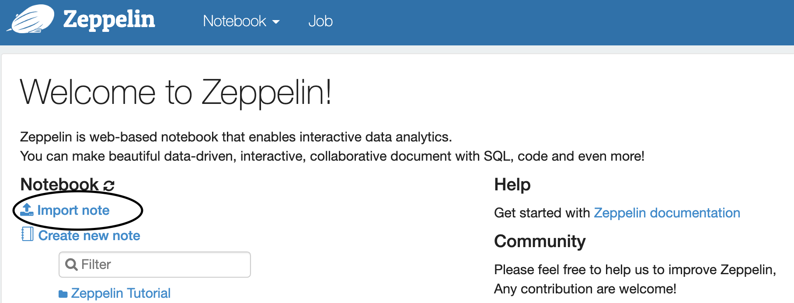
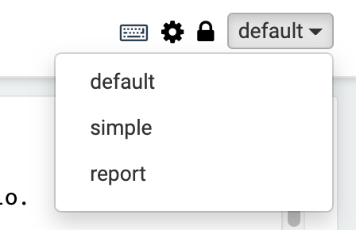

# PAAExport
PAAExport is a command-line utility that extracts data from the `appfoundry.db` SQlite data base produced by `PAA`, Pivotal Application Analyzer. The files extracted are formatted to serve as a source for the `Zeppelin-based` notebook designed to allow exploration of `PAA` results without the need for the `forge` executable, which cannot be left on customer's computers.

# Usage

## Installing `zeppelin`
Navigate your browser to [https://zeppelin.apache.org/download.html](https://zeppelin.apache.org/download.html) and select the first download package.


Decompress the file and move to a directory on your home directory and rename the resulting directory to `~/zepellin`.

You are now ready to copy some files from the repo or zip file into your newly install zeppelin directory. 

First, you'll need some data to test that your notebook is working properly.

In your `~/zeppelin` directory `mkdir data`, then copy the files from `paa-export/data` into this data directory.

Next we need to copy the configuration files from `paa-export/zeppelin/conf` to `~/zeppelin/conf` 


Now move into that directory and run the script as indicated below

```bash
cd ~/zeppelin
bin/zeppelin-daemon.sh start
Log dir doesn't exist, create /Users/swoods/zeppelin/logs
Pid dir doesn't exist, create /Users/swoods/zeppelin/run
Zeppelin start
```
Those two warnings are normal the first time you start `zeppelin`.

After starting, open browser to `localhost:8080`. You should see the `Zeppelin` welcome screen. Now we have to enable several visualizations.

## Setting up visualizations

* Select the `Helium` item from the menu in the upper right corner.


* Enable all the `ultimate` on the first tab. visualizations by clicking `Enable`. Also, enable `zeppelin-number`. Feel free to enable others if you like. 



* After enabling, you'll need to `restart` to have them become available


```bash
bin/zeppelin-daemon.sh restart
```


## Other useful commands
Commands to `stop/status`:

```bash
bin/zeppelin-daemon.sh stop
bin/zeppelin-daemon.sh status
```

Useful links:
https://zeppelin.apache.org/docs/0.8.2/quickstart/install.html

## Important: Always start `zeppelin` from the `zeppelin` directory. It affects the home directory within `zepellin`.
The notebook expects home to be the `zeppelin` directory. 

## Using `PAAExport`
The most simple approach is to copy `PAAExport` into the same directory as the `forge` executable. The `appfoundry.db` SQlite data base in normally also in this directory. `PAAExport` expects two command line arguments: 

* Path to appfoundry.db file
* Run number to extract

```bash
./PAAExport appfoundry.db 1
```

The csv files produced are as follows:

```bash
code-metrics.csv
portfolio-summary.csv
portfolio-detail.csv
score-datail-by-line.csv
score-datail-by-file.csv
top-APIs.csv
crosstab.csv
```
Copy these files to the `~/zeppelin/data` directory to use for the `zeppelin` report.

* Also, you'll need to import the notebook(s) you find in the repo. Within the `zeppelin` application, the `import note` menu item is on the welcome page, the first page you land on to login. You can also get to that page by clicking the `zeppelin` icon in upper left of any page. Click `Import note` to import the notebook. Navigate to where you have the notebooks from this web site.



* Select the notebook you imported


* Run all paragraphs in the notebook


* Select your operating mode:


`Default`
This is like a developer mode, you see everything, code included.


`Simple`
This is for a non-technical, non-coding use.

`Report`
Final product, all controls and code hidden.



